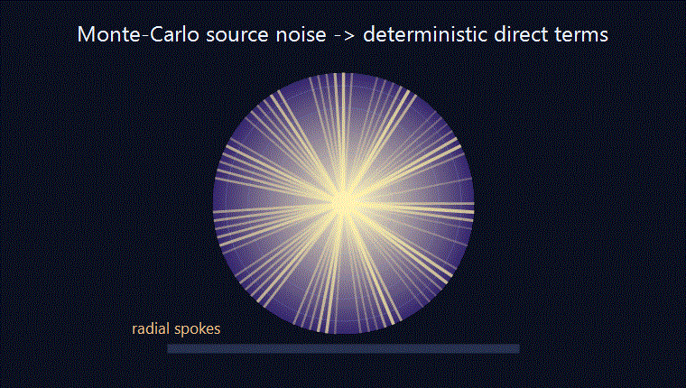
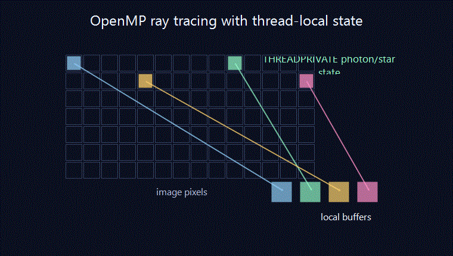
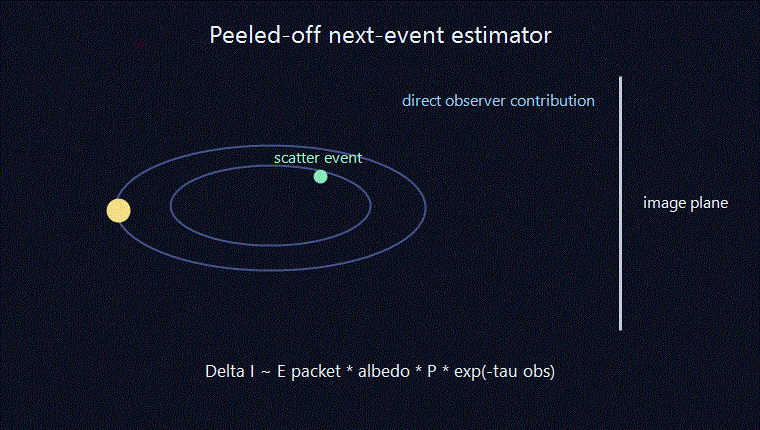

# RADMC-3D Fork for Stable Disk Image Ray Tracing

This repository is a fork of **RADMC-3D 2.0** with targeted changes for
high-resolution synthetic imaging of protoplanetary disks on spherical grids.

The corresponding pipeline to run it can be found here:
https://github.com/jonasvc/radmc-simulation-suite

The purpose of
this codebase is to improve the RADMC-3D Fortran side for the kind of disk
models where very fine grids, high photon counts, scattering, and multi-core
ray tracing expose numerical and Monte-Carlo artifacts.

The two main goals are:

- make multi-threaded ray tracing reproducible and stable;
- reduce radial spoke artifacts in thermal and scattered-light disk images.

## Why This Fork Exists

In high-resolution spherical-grid disk models, RADMC-3D can run into two
practical issues that are not obvious in smaller example models.

First, multi-threaded ray tracing can become non-reproducible if shared
module-level state is written by several OpenMP threads at the same time. Two
identical image runs can then produce different intensities, not because the
physics changed, but because the order of thread execution changed.

Second, central-star Monte-Carlo photon packets naturally travel on radial
paths through the grid. On a 3D spherical grid this can leave phi-correlated
shot noise in the dust temperature and scattering source arrays. When the
camera ray-traces through those arrays, the noise appears as radial spokes in
the final image.

This fork addresses those two issues while keeping the normal RADMC-3D workflow
and file formats intact.

<p align="center">
  
</p>

## The Physics Behind The Spokes

The spoke artifact is not a ray-tracing interpolation feature. It is mostly a
Monte-Carlo source-function noise problem that becomes very visible on
spherical grids.

For a central star, photon packets are launched outward and tend to move along
quasi-radial paths. During the thermal Monte-Carlo, absorbed stellar energy is
accumulated in `mc_cumulener`, which later sets the dust temperature. During
the scattering Monte-Carlo, the scattering source is accumulated in
`mcscat_scatsrc_iquv`. Both arrays are cell-binned Monte-Carlo estimators.

If only a small number of photon packets contributes to a given `(r, theta,
phi)` cell, the local source value has normal Poisson noise. On a spherical
grid that noise is not randomly oriented in the final image: because the photon
paths from the central star are radial, neighboring noisy cells line up into
radial bright and dark streaks. The camera then ray-traces through this noisy
source field and the noise becomes visible as spokes.

The fork reduces this in two physically motivated ways:

- direct central-star heating is replaced by an equivalent deterministic
  radial attenuation integral where the geometry allows it;
- direct first scattering from the central star is also added deterministically,
  while higher-order scattering remains Monte-Carlo.

These estimators are meant to remove sampling noise from contributions whose
geometry is already known. They do not erase real asymmetric density structure:
each azimuthal wedge is still evaluated separately.

In simple terms, the noisy cell estimate scales like:

```math
\frac{\sigma_\mathrm{cell}}{S_\mathrm{cell}}
\sim
\frac{1}{\sqrt{N_\mathrm{cell}}}
```

where $`N_\mathrm{cell}`$ is the number of photon packets that contribute to a given cell.
For a model with millions of cells, even very large photon counts can still
leave only a small number of effective packets per cell.

For the direct stellar part, the relevant physics is already deterministic: the
stellar luminosity entering an angular wedge is attenuated radially as

```math
\mathrm{d}L_\mathrm{abs}(r,\theta,\phi)
=
L_\star(\theta,\phi)\,
\exp[-\tau_\star(r,\theta,\phi)]\,
\mathrm{d}\tau_\star
```

or, equivalently, the local direct stellar heating is proportional to the
absorbed fraction of the attenuated stellar beam. This fork uses that radial
attenuation directly instead of estimating the same first-flight contribution
from random photon packet hits.

For scattered light, the first-scattering source from a central star has the
same structure: stellar light reaches a cell with an attenuation factor
$`\exp(-\tau_\star)`$, scatters with the local albedo and phase function, and then
contributes to the observer direction. Schematically,

```math
j_\nu^\mathrm{scat}
\propto
F_{\nu,\star}\,
\exp(-\tau_\star)\,
\omega_\nu\,
P(\cos \Theta_\mathrm{scat})
```

where $`\omega_\nu`$ is the single-scattering albedo and
$`P(\cos\Theta_\mathrm{scat})`$ is the scattering phase function. The fork adds this direct
first-scattering term deterministically when the geometry supports it.

## Multi-Threaded Ray Tracing Fixes

The ray-tracing loops for rectangular and circular images are parallelized with
OpenMP, but the important part is not just adding parallel loops. Several
shared arrays and counters had to be made thread-safe so that repeated
multi-core runs converge to the same result.

The main fixes are:

- each thread uses its own local intensity buffer for the pixel it is tracing;
- global diagnostic counters are updated atomically;
- stellar-sphere and per-photon Monte-Carlo state that must differ between
  threads is marked with OpenMP `THREADPRIVATE`;
- dust source-function scratch arrays are local to each call instead of shared;
- pixel loops are distributed with OpenMP while avoiding unsafe diagnostic I/O.

The result is a ray tracer that can use multiple cores without the large
run-to-run intensity differences seen in the uncorrected parallel version.

<p align="center">
  
</p>

## Spherical Boundary Robustness

Large spherical-grid runs can occasionally hit a floating-point boundary case:
a ray lands numerically just outside the next cell even though physically it is
on the cell wall. In the original code this can trigger fatal errors such as
`Photon outside of NEXT cell` or a cell index being set to zero while the raw
coordinates are still inside the grid.

This fork keeps the original fatal behavior for real, large inconsistencies.
For tiny boundary-level violations, it applies a very small forward nudge along
the ray direction and recomputes the spherical coordinates. This is a
bookkeeping correction only: the displacement is far below the resolved cell
scale and does not change the physical ray path in any meaningful way.

## Thermal Spoke Reduction

For a single central star on a regular spherical grid, the direct stellar
heating contribution can be computed deterministically along radial rays. This
fork uses that fact to remove the dominant phi-correlated Monte-Carlo noise in
the thermal dust temperature field.

The deterministic heating estimator follows the stellar luminosity through each
angular wedge and attenuates it with the local optical depth. The remaining
thermal processes still use the normal RADMC-3D machinery. The key point is
that this does not force the model to be axisymmetric. Each azimuthal wedge is
still treated independently, so genuine asymmetric density structure remains
visible. Only the random direct-stellar sampling noise is replaced by the
deterministic equivalent.

This mainly improves `noscat` or thermal-dominated images where spokes were
caused by noisy `mc_cumulener` deposition during the thermal Monte-Carlo.

## Scattered-Light Spoke Reduction

Scattered-light images have a related but separate source of noise: the
Monte-Carlo scattering source function. This fork adds several tools for that
side of the problem.

### Deterministic Direct First Scattering

The direct first-scattering contribution from the central star is added
deterministically when the grid and source geometry support it. The usual
Monte-Carlo walk still continues, but the duplicate noisy first-leg source
deposit is suppressed.

This reduces the strongest radial component of the scattered-light noise while
leaving higher-order scattering to the normal Monte-Carlo machinery.

### Stratified Sampling

The stellar emission direction and first-leg optical-depth sampling are
stratified. This reduces variance in the launched photon distribution and makes
the remaining Monte-Carlo noise less structured.

### Phi Coarsening

The new `mcscat_phi_coarsen` control averages the scattering source over blocks
of neighboring phi cells after the scattering Monte-Carlo has finished.

This is useful when the underlying model is axisymmetric or only mildly
asymmetric, because it suppresses high-frequency phi noise at low cost. It
should be used carefully for spirals, vortices, or strong asymmetries, because
coarsening can also smooth real azimuthal structure.

Conceptually:

- `mcscat_phi_coarsen = 1` means no coarsening;
- moderate values reduce spoke texture while keeping broad asymmetries;
- values close to the full number of phi cells intentionally collapse the
  scattering source toward axisymmetry.

### Peeled-Off Scattering Estimator

The optional `mc_peeledoff` mode uses a next-event estimator for scattering
images. At each scattering event, the code sends a deterministic test ray
toward the observer and deposits the attenuated contribution directly into the
image plane.

The deposited contribution has the usual next-event form:

```math
\Delta I_\mathrm{pixel}
\propto
E_\mathrm{packet}\,
\omega_\nu\,
P(\cos \Theta_\mathrm{obs})\,
\exp(-\tau_\mathrm{obs})
```

Here $`\tau_\mathrm{obs}`$ is the optical depth from the scattering event to the observer.
Instead of storing that scattered energy in a noisy cell source function and
later ray-tracing through it, the contribution is added directly to the image
pixel that sees the event.

This bypasses the noisy cell-binned scattering source for those events. It is
more expensive than phi coarsening, but it is better suited to strongly
asymmetric models where smoothing in phi would erase the structures being
studied.

<p align="center">
  
</p>

## New RADMC Controls

The fork adds two main user-facing controls:

```text
mcscat_phi_coarsen
mc_peeledoff
```

They are read from `radmc3d.inp` together with the existing RADMC-3D runtime
parameters.

Typical choices are:

| Model type | `mcscat_phi_coarsen` | `mc_peeledoff` |
| --- | --- | --- |
| Axisymmetric disk | high, up to `n_phi` | `0` |
| Mild low-order asymmetry | moderate | `0` |
| Strong asymmetry | `1` | `1` |
| Tight spirals or vortices | low, often `2` to `4` | optional |
| 2D axisymmetric model | `1` | `0` |

These controls are optional. If they are omitted, the fork keeps behavior close
to standard RADMC-3D defaults: no phi coarsening and no peeled-off image
estimator.

## What Is Not Changed

This fork does not replace RADMC-3D's general radiative-transfer workflow. It
does not introduce a new model format, a new Python pipeline, or a different
way of preparing normal RADMC input files.

It also does not make the variance-reduction estimators universal. The
deterministic direct-source estimators are intended for regular spherical grids
with a central star. They are not a complete treatment for off-center stars,
multi-star systems, or arbitrary external illumination.

## Where The Code Changes Are

The main Fortran-side changes are in:

```text
src/main.f90
src/montecarlo_module.f90
src/camera_module.f90
src/amrray_module.f90
src/sources_module.f90
```

In broad terms:

- `main.f90` reads the new runtime controls;
- `montecarlo_module.f90` contains the deterministic estimators, stratified
  photon metadata, scattering-source coarsening, and peeled-off deposits;
- `camera_module.f90` contains the OpenMP-safe image loops and image-side
  peeled-off setup/teardown;
- `amrray_module.f90` contains the spherical boundary robustness fixes;
- `sources_module.f90` avoids shared scratch state during threaded source
  calculations.

## Upstream RADMC-3D

RADMC-3D is developed by Cornelis Dullemond and collaborators. The upstream
manual in `manual/` remains the reference for general RADMC-3D usage.

Upstream website:

http://www.ita.uni-heidelberg.de/~dullemond/software/radmc-3d

This repository is a research fork with additional numerical and
variance-reduction changes for disk-imaging work.
